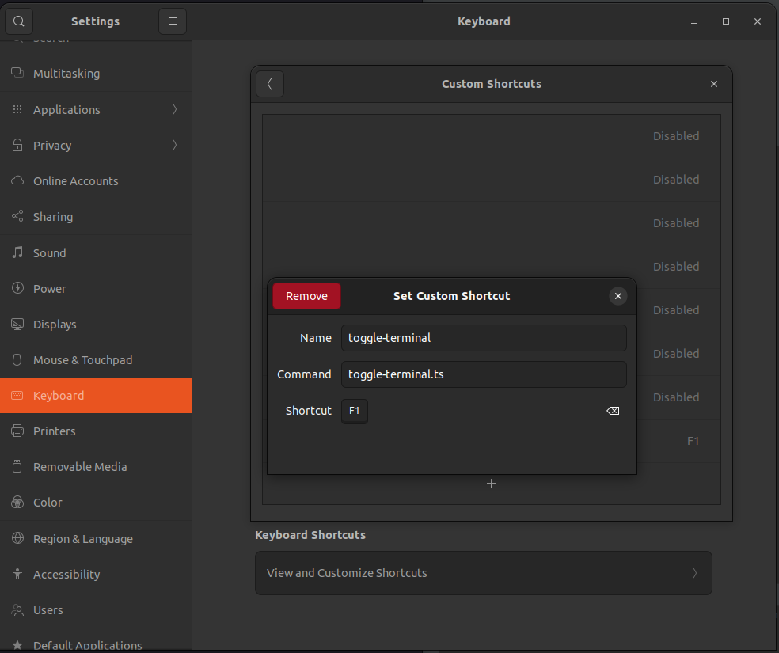

# toggle-terminal

Turn (almost) any graphical terminal emulator, into a dropdown/quake style
terminal, with a hotkey to activate/deactivate it.

This is a modified port of
[any\_term\_dropdown.sh](https://github.com/gotbletu/shownotes/blob/master/any_term_dropdown.sh),
to TypeScript and [Deno](https://deno.land/).

## Prerequisites

- coreutils
- xdotool
- wmutils (via [wmutils on github](https://github.com/wmutils/core),
  [wmutils-git in the AUR](https://aur.archlinux.org/packages/wmutils-git/), or
  [Pavel PPA](https://launchpad.net/~spvkgn/+archive/ubuntu/ppa))
- curl
- unzip

For example, to install them in Ubuntu 22.04:

```bash
sudo bash -c "
set -euo pipefail
IFS=$'\t\n'

add_spvkgn_ppa() {
  apt update
  apt install -y software-properties-common
  add-apt-repository ppa:spvkgn/ppa -y --no-update
  sed -E s/jammy/focal/g -i /etc/apt/sources.list.d/spvkgn-ubuntu-ppa-jammy.list
  mv /etc/apt/sources.list.d/spvkgn-ubuntu-ppa-{jammy,focal}.list

  cat > /etc/apt/preferences.d/99spvkgn-repository <<'EOF'
# Allow upgrading only wmutils-core from spvkgn repository
Package: wmutils-core
Pin: release n=spvkgn
Pin-Priority: 500

# Never prefer other packages from the spvkgn repository
Package: *
Pin: release n=spvkgn
Pin-Priority: 1
EOF
  apt update
}

add_spvkgn_ppa
apt install -y coreutils xdotool wmutils-core curl unzip
"
```

## Install

Download [toggle-terminal.ts](toggle-terminal.ts) into a directory on your
`PATH`, and make it executable.

For example, to download it into `/usr/local/bin/`:

```bash
sudo bash -c "
set -euo pipefail
IFS=$'\t\n'

curl -fo /usr/local/bin/toggle-terminal.ts https://raw.githubusercontent.com/hugojosefson/toggle-terminal/main/toggle-terminal.ts
chmod +x /usr/local/bin/toggle-terminal.ts
"
```

### First-time run

Run it once, for it to find or cache Deno, and any dependencies. Also for you to
make sure it works:

```sh
toggle-terminal.ts
```

### Bind to hotkey

Bind the script to a hotkey in your Desktop/Keyboard settings.

For example, to bind it to `F1` in Ubuntu Desktop 22.04:

- Open **Settings**.
- Click **Keyboard** in the left menu.
- Under **Keyboard Shortcuts**, click **View and Customize Shortcuts**.
- Scroll down and choose **Custom Shortcuts**.



- Click **+**.
  - Name: `toggle-terminal`
  - Command: `toggle-terminal.ts`.
  - Shortcut: `F1`
- Close the dialogs.

## Usage

Click `F1` to activate / deactivate the terminal.
